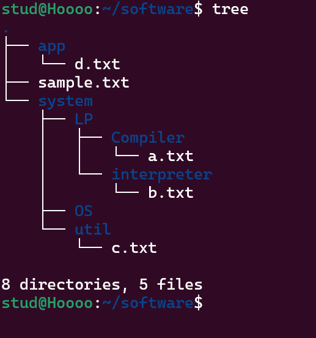

# 🔅System programming week2🔅
# **⭐기본 명령어 사용**
# 날짜 및 시간 확인
$ date
2022. 01. 01. (토) 12:26:10 KST

# 시스템 정보 확인
$ hostname
linux.sookmyung.ac.kr

$ uname
Linux

$ uname -a
Linux Ubuntu 5.11.0-31-generic #33-Ubuntu SMP Wed Aug 11 13:19:04 UTC 2021 x86_64 x86_64 x86_64 GNU/Linux

# 사용자 정보 확인
$ whoami
chang

$ who
chang
tty2 2022-01-09 12:19 (tty2)

# 디렉터리 내용 확인
$ ls
공개  다운로드  문서  바탕화면  비디오  사진  음악  템플릿

# 패스워드 변경
$ passwd
passwd: chang용 암호를 변경하는 중
기존 로그인 암호를 입력하십시오:
새 암호:
새 암호를 다시 입력하십시오:
passwd: 암호(chang용)가 성공적으로 변경되었습니다.

# 화면 정리
$ clear

# **⭐파일과 디렉터리**

# 🟠파일의 종류

## 일반 파일 (ordinary file)
- 데이터를 가지고 있으며 디스크에 저장된다.
- 텍스트 파일, 이진 파일 등으로 구분된다.

## 디렉터리 (directory) 또는 폴더 (folder)
- 파일들을 계층적으로 조직화하는 데 사용되는 일종의 특수 파일.
- 디렉터리 내에 파일이나 서브디렉토리들이 존재한다.

## 장치 파일 (device special file)
- 물리적인 장치에 대한 내부적인 표현.
- 키보드 (stdin), 모니터 (stdout), 프린터 등도 파일처럼 사용된다.

## 심볼릭 링크 파일 (symbolic link file)
- 어떤 파일을 가리키는 또 하나의 경로명을 저장하는 파일.

# 🟠명령어의 경로 확인: `which`

## 사용법

$ which 명령어

- 명령어의 절대 경로를 보여준다.

## 예

$ which ls /bin/ls

$ which pwd /bin/pwd

$ which passwd /bin/passwd

# **⭐디렉터리 명령어**

# 🟠현재 작업 디렉터리 출력: `pwd` (print working directory)

## 사용법
$ pwd

-현재 작업 디렉터리의 절대 경로명을 출력한다.

## 현재 작업 디렉터리 (current working directory)
- 현재 작업 중인 디렉터리
- 
- 로그인하면 홈 디렉터리에서부터 작업이 시작된다.

## 예
$ pwd

/home/chang/바탕화면

$ cd ~

$ pwd

/home/chang

# 🟠디렉터리이동: cd(change directory)

## 사용법
$ cd [디렉터리]

-현재 작업 디렉터리를 지정된 디렉터리로 이동한다.

-디렉터리를 지정하지 않으면 홈 디렉터리로 이동한다.

## 예
$ cd 

$ cd

$ cd 바탕화면

$ pwd

/home/chang/바탕화면

$ cd ..  // 부모 디렉터리로 이동

# 🟠디렉터리생성: mkdir(make directory)

## 사용법
$mkdir [-p] 디렉터리+

-디렉터리(들)을 새로 만든다.

## 예
$ cd ~ 
// 홈 디렉터리로 이동
$ mkdir test 

$ mkdir test temp 

$ ls -l

 drwxrwxr-x. 2 chang chang 6 5월 12 10:12 temp
 
 drwxrwxr-x. 2 chang chang 6 5월 12 10:12 test

# 중간 디렉터리 자동 생성 옵션: `-p`
- 필요한 경우 중간 디렉터리를 자동으로 만들어준다.

## 예: ~/dest 디렉터리가 없는 경우
$ mkdir ~/dest/dir1

mkdir: '/home/chang/dest/dir1' 디렉터리를 만들 수 없습니다: 그런 파일이나 디렉터리가 없습니다

$ mkdir -p ~/dest/dir1

# 🟠디렉터리삭제: rmdir(remove directory)

## 사용법
$rmdir디렉터리+

-디렉터리(들)을 삭제한다.
-주의: 빈 디렉토리만 삭제할 수 있다.

## 예
$ rmdir test

 rmdir: failed to remove ‘test’: 디렉터리가 비어있지 않음

 # **🔥2주차 실습내용🔥**

