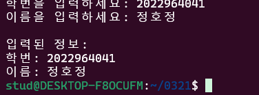

# 🔅System programming week3🔅
# **⭐파일 복사**

# 🟠파일 복사 : cp(copy)

## 사용법

$ cp [-i] 파일1 파일2

- 파일1을 파일2에 복사한다. -i는 대화형 옵션이다.

 ## 예
$ cp cs1.txt cs2.txt

 $ ls –l cs1.txt cs2.txt
 -rw-r--r-- 1 chang chang 2088 10월 23 13:37 cs1.txt
 -rw-r--r-- 1 chang chang 2088 10월 23 13:45 cs2.txt
 
 $ cp /etc/hosts hostnames 

 ## 대화형 옵션: cp -i
 -복사 대상 파일과 이름이 같은 파일이 이미 존재하면 덮어쓰기 (overwrite) !
 
 -보다 안전한 사용법: 대화형 -i(interactive) 옵션을 사용

 ## 예
 $ cp–i cs1.txt cs2.txt 
cp: overwrite ‘cs2.txt’? n

## 파일을 디렉터리로 복사

$ cp 파일 디렉터리

-파일을 지정된 디렉터리에 복사한다.

$ cp 파일1 ... 파일n 디렉터리

-여러 개의 파일들을 지정된 디렉터리에 모두 복사한다.

## 예
$ cp cs1.txt /tmp

$ ls –l /tmp/cs1.txt
-rw-r--r-- 1 chang chang 2088 10월 23 14:31 /tmp/cs1.txt

$ cp cs1.txt cs2.txt /tmp

## 디렉터리 전체 복사 : cp -r

$cp [-r] 디렉터리1 디렉터리2

-r은 리커전 옵션으로 디렉터리1 전체를 디렉터리2에 복사한다

-하위 디렉터리를 포함한 디렉터리 전체를 복사

## 예
$cp -r test temp

# **⭐파일 이동**

# 🟠파일이동: mv(move)

## 사용법

$ mv [-i] 파일1 파일2

-파일1의 이름을 파일2로 변경한다. -i는 대화형 옵션이다.

## 예
$ mv cs2.txt cs3.txt

$ ls -l
-rw-r--r-- 1 chang chang 2088 10월 23 13:37 cs1.txt
-rw-r--r-- 1 chang chang 2088 10월 23 13:56 cs3.txt

## 대화형 옵션:mv -i

-이동 대상 파일과 이름이 같은 파일이 이미 존재하면 덮어쓰기(overwrite)

-보다 안전한 사용법: 대화형 -i(interactive) 옵션을 사용

## 예
$ mv –i cs1.txt cs3.txt 
mv: overwrite ‘cs3.txt’? n

## 파일을 디렉터리로 이동

$ mv 파일 디렉터리

-파일을 지정된 디렉터리로 이동한다.

 $ mv 파일1 ... 파일n 디렉터리
 
-여러개의 파일들을 지정된 디렉터리로 모두 이동한다.

## 예
$ mv cs3.txt /tmp

$ ls -l /tmp/cs3.txt-rw-r--r-- 1 chang chang 2088 10월 23 13:56 /tmp/cs3.txt

$ mv cs1.txt cs3.txt /tmp

## 디렉터리 이름 변경

$ mv 디렉터리1 디렉터리2

- 디렉터리1을 지정된 디렉터리2로 이름을 변경한다.

## 예

$ mkdir temp

$ mv temp tmp

# **⭐파일 삭제**

# 🟠파일삭제: rm(remove) 

## 사용법

$ rm [-i] 파일+

-파일(들)을 삭제한다.-i는 대화형 옵션이다.

## 예

$ rm cs1.txt 

$ rm cs1.txt cs3.txt

## 대화형옵션: rm-i

$ rm –i cs1.txt 

rm: remove 'cs1.txt'? n

# 🟠디렉터리 전체 삭제

## 디렉터리 전체 삭제: rm -r

$ rm [-ri] 디렉터리

-r은 리커전 옵션으로 디렉터리 아래의 모든 것을 삭제한다. -i는 대화형 옵션

## 예

$ rm test
 rm: cannot remove 'test': 디렉터리입니다
 
$ rmdir test
 rmdir: failed to remove 'test': 디렉터리가 비어있지 않음
 
$ rm–ri test
 rm: descend into directory 'test'? y
 rm: remove regular file 'test/cs3.txt'? y
 Rm: remove regular file ‘test/cs1.txt’? y
 rm: remove directory 'test'? y

 # **🔥3주차 실습내용🔥**

