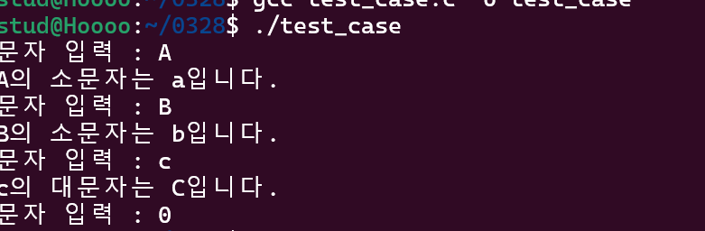

# 🔅System programming week4🔅

# ⭐연산자 우선순위

연산자 우선순위(Operator Precedence)는 프로그래밍 언어에서 여러 개의 연산자가 함께 사용될 때, 어떤 연산자가 먼저 실행될지를 결정하는 규칙이다. 일반적으로 수학적인 연산 우선순위와 유사하지만, 프로그래밍 언어마다 조금씩 차이가 있을 수 있다.

## 대표적인 연산자 우선순위 (C, Java, Python 기준)
우선순위가 높은 연산자가 먼저 실행된다.

| 우선순위 (높음 → 낮음) | 연산자 | 설명 |
|----------------|------------|----------------|
| 1 | `()` | 괄호 (가장 높은 우선순위) |
| 2 | `++`, `--`, `~`, `!` | 단항 연산자 (전위 증가/감소, 논리 부정, 비트 보수) |
| 3 | `*`, `/`, `%` | 곱셈, 나눗셈, 나머지 연산 |
| 4 | `+`, `-` | 덧셈, 뺄셈 |
| 5 | `<<`, `>>` | 비트 시프트 연산 |
| 6 | `<`, `<=`, `>`, `>=` | 비교 연산자 |
| 7 | `==`, `!=` | 동등 비교 연산자 |
| 8 | `&` | 비트 AND |
| 9 | `^` | 비트 XOR |
| 10 | `|` | 비트 OR |
| 11 | `&&` | 논리 AND |
| 12 | `||` | 논리 OR |
| 13 | `? :` | 삼항 연산자 |
| 14 | `=`, `+=`, `-=`, `*=`, `/=`, `&=`, `|=`, `^=`, `>>=`, `<<=` | 대입 연산자 |
| 15 | `,` | 쉼표 연산자 (가장 낮은 우선순위) |

# ⭐메모리 구조

# 메모리 영역 설명

## 1. Text 영역

**텍스트 영역**은 코드를 실행하기 위해 저장되는 영역이다.  
흔히 **코드 영역**이라고도 하며, 프로그램을 실행시키기 위해 필요한 것들이 저장된다.  

- **명령문**들이 저장되는 영역  
- **제어문, 함수, 상수** 등이 포함됨  

---

## 2. Data 영역

**데이터 영역**은 프로그램에서 **전역 변수, 정적 변수** 등이 저장되는 공간이다.  
이 변수들은 **프로그램 실행 전에 선언**되어 **프로그램이 끝날 때까지 메모리에 남아있다**는 특징이 있다.

Data 영역은 두 가지로 나뉜다.

1. **초기화된 변수 영역** (Initialized Data Segment)  
2. **초기화되지 않은 변수 영역** (Uninitialized Data Segment, BSS: Block Started by Symbol)

---

## 3. Heap 영역

**힙 영역**은 **사용자가 직접 관리하는 메모리 영역**이다.  
즉, **동적으로 할당된 변수들이 저장되는 공간**이다.

- `new` 연산자로 생성하는 객체 (Java, C++)  
- **클래스 인스턴스, 참조 변수 등**이 저장됨  
- 언어마다 차이가 있지만, 일반적으로 **동적 할당 영역**이라고 보면 됨  
- **낮은 주소에서 높은 주소 방향으로 메모리가 할당됨**  

---

## 4. Stack 영역

**스택 영역**은 함수를 호출할 때 **지역 변수, 매개변수** 등이 저장되는 공간이다.

- `main()` 함수 내부의 지역 변수도 포함됨  
- 함수가 종료되면 해당 함수의 변수들은 **자동으로 해제됨**  
- **Stack 자료구조의 `pop`과 유사한 방식으로 동작**  

### 스택 오버플로우(Stack Overflow)

재귀 호출이 깊어지면 **Stack 영역을 초과하여** Stack Overflow 오류가 발생할 수 있다.  
즉, 함수의 지역 변수와 매개변수들이 계속 **Stack에 할당되다가 제한된 메모리를 초과하면** 오류가 발생한다.

> 📌 **Heap 영역과 반대로, Stack 영역은 높은 주소에서 낮은 주소 방향으로 메모리가 할당됨**  

# ⭐파일 복사

# 🟠파일 복사 : cp(copy)

## 사용법

$ cp [-i] 파일1 파일2

- 파일1을 파일2에 복사한다. -i는 대화형 옵션이다.

 ## 예
$ cp cs1.txt cs2.txt

 $ ls –l cs1.txt cs2.txt
 -rw-r--r-- 1 chang chang 2088 10월 23 13:37 cs1.txt
 -rw-r--r-- 1 chang chang 2088 10월 23 13:45 cs2.txt
 
 $ cp /etc/hosts hostnames 

 ## 대화형 옵션: cp -i
 -복사 대상 파일과 이름이 같은 파일이 이미 존재하면 덮어쓰기 (overwrite) !
 
 -보다 안전한 사용법: 대화형 -i(interactive) 옵션을 사용

 ## 예
 $ cp–i cs1.txt cs2.txt 
cp: overwrite ‘cs2.txt’? n

## 파일을 디렉터리로 복사

$ cp 파일 디렉터리

-파일을 지정된 디렉터리에 복사한다.

$ cp 파일1 ... 파일n 디렉터리

-여러 개의 파일들을 지정된 디렉터리에 모두 복사한다.

## 예
$ cp cs1.txt /tmp

$ ls –l /tmp/cs1.txt
-rw-r--r-- 1 chang chang 2088 10월 23 14:31 /tmp/cs1.txt

$ cp cs1.txt cs2.txt /tmp

## 디렉터리 전체 복사 : cp -r

$cp [-r] 디렉터리1 디렉터리2

-r은 리커전 옵션으로 디렉터리1 전체를 디렉터리2에 복사한다

-하위 디렉터리를 포함한 디렉터리 전체를 복사

## 예
$cp -r test temp

# ⭐파일 이동

# 🟠파일이동: mv(move)

## 사용법

$ mv [-i] 파일1 파일2

-파일1의 이름을 파일2로 변경한다. -i는 대화형 옵션이다.

## 예
$ mv cs2.txt cs3.txt

$ ls -l
-rw-r--r-- 1 chang chang 2088 10월 23 13:37 cs1.txt
-rw-r--r-- 1 chang chang 2088 10월 23 13:56 cs3.txt

## 대화형 옵션:mv -i

-이동 대상 파일과 이름이 같은 파일이 이미 존재하면 덮어쓰기(overwrite)

-보다 안전한 사용법: 대화형 -i(interactive) 옵션을 사용

## 예
$ mv –i cs1.txt cs3.txt 
mv: overwrite ‘cs3.txt’? n

## 파일을 디렉터리로 이동

$ mv 파일 디렉터리

-파일을 지정된 디렉터리로 이동한다.

 $ mv 파일1 ... 파일n 디렉터리
 
-여러개의 파일들을 지정된 디렉터리로 모두 이동한다.

## 예
$ mv cs3.txt /tmp

$ ls -l /tmp/cs3.txt-rw-r--r-- 1 chang chang 2088 10월 23 13:56 /tmp/cs3.txt

$ mv cs1.txt cs3.txt /tmp

## 디렉터리 이름 변경

$ mv 디렉터리1 디렉터리2

- 디렉터리1을 지정된 디렉터리2로 이름을 변경한다.

## 예

$ mkdir temp

$ mv temp tmp

# ⭐파일 삭제

# 🟠파일삭제: rm(remove) 

## 사용법

$ rm [-i] 파일+

-파일(들)을 삭제한다.-i는 대화형 옵션이다.

## 예

$ rm cs1.txt 

$ rm cs1.txt cs3.txt

## 대화형옵션: rm-i

$ rm –i cs1.txt 

rm: remove 'cs1.txt'? n

# 🟠디렉터리 전체 삭제

## 디렉터리 전체 삭제: rm -r

$ rm [-ri] 디렉터리

-r은 리커전 옵션으로 디렉터리 아래의 모든 것을 삭제한다. -i는 대화형 옵션

## 예

$ rm test
 rm: cannot remove 'test': 디렉터리입니다
 
$ rmdir test
 rmdir: failed to remove 'test': 디렉터리가 비어있지 않음
 
$ rm–ri test
 rm: descend into directory 'test'? y
 rm: remove regular file 'test/cs3.txt'? y
 Rm: remove regular file ‘test/cs1.txt’? y
 rm: remove directory 'test'? y

  # **🔥3주차 실습내용🔥**
  - 대문자를 입력받고 소문자로 출력하고, 소문자를 입력받고 대문자로 출력하는 프로그램을 작성하시오. 단 0을 입력하면 종료하시오.

[입출력 형식]

문자 입력 : A

A의 소문자는 a입니다.

문자 입력 : B

B의 소문자는 b입니다.

문자 입력 : c

c의 대문자는 C입니다.

문자 입력 : 0

